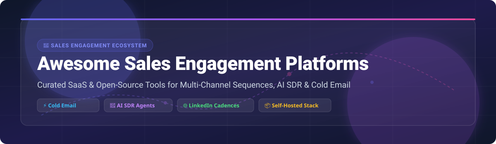

# 🚀 Awesome Sales Engagement Platform (SEP) Ecosystem

**Curated List of Commercial SaaS Products & Self-Hosted Open-Source Sales Engagement Platforms**

*Focused on Multi-Channel Sequences, Cold Email Automation, AI SDR Agents, B2B Lead Generation & Revenue Intelligence*

  
  
  
  
  
  
  

---

## 📌 Executive Overview & Ecosystem Trends

This repository tracks top-tier **commercial sales engagement platforms (SEPs)** and **open-source sales automation tools** designed to orchestrate multi-channel outreach — including automated cold email sequences, LinkedIn messaging cadences, phone dialers, buying signal monitoring, and AI SDR personalization.

### 🌟 Key Industry Highlights (Updated 2026)
- **🤖 Autonomous AI SDRs**: Transitioning from static multi-step cadence templates to LLM-driven autonomous agents capable of research, qualification, personalized copy generation, and automated objection handling.
- **✉️ Deliverability Infrastructure**: Increasing sender reputation requirements (SPF, DKIM, DMARC, automated inbox warm-up, dedicated domain rotation) across both commercial and self-hosted tools.
- **🌐 Open-Source Growth**: Self-hosted alternatives empower privacy-conscious sales teams to maintain full control over lead databases, custom LLM APIs, and LinkedIn session state without per-seat overhead.

---

## 📚 Table of Contents

- [🏢 SaaS / Hosted Sales Engagement Platforms](#-saas--hosted-sales-engagement-platforms)
- [🔓 Open-Source GitHub Projects](#-open-source-github-projects)
- [🛠️ Architectural Recommendations](#️-architectural-recommendations)
- [🤝 How to Contribute](#-how-to-contribute)
- [💖 Support & Sponsorship](#-support--sponsorship)
- [📈 Star History](#-star-history)
- [⚖️ Disclaimer & Security Guidelines](#️-disclaimer--security-guidelines)

---

## 🏢 SaaS / Hosted Sales Engagement Platforms

> 📊 **Market Insights**: The global **Sales Engagement Platform (SEP) market** was valued at **~$7.4 Billion in 2024** and is projected to reach **~$18.6 Billion by 2032** (CAGR of ~12.2%). The sector is **moderately fragmented**, characterized by dominant enterprise category leaders (*Salesforce, Outreach, Salesloft, Apollo.io*) operating alongside a dynamic ecosystem of high-growth AI SDR startups and specialized outreach tools targeting SMBs and mid-market sales teams.

### 📊 Commercial SEP Comparison Matrix

*The following table is sorted by **Company Scale (Valuation / Revenue)** in descending order.*

| 🏢 SaaS Platform | 💰 Starting Price | 🎁 Free Tier / Free Trial | 📈 Company Scale (Revenue / Valuation) |
| :--- | :--- | :--- | :--- |
| **[Salesforce Sales Engagement](https://www.salesforce.com/products/sales-cloud/features/sales-engagement/)** Native Salesforce cadences, Einstein AI lead scoring, and automated email tracking for enterprise workflows. | `$75/user/month` | `30-day free trial (no credit card required)` | **~$280 Billion Market Cap** (~$34.9B ARR) |
| **[Outreach](https://www.outreach.io/)** Enterprise revenue workflow platform with multi-channel sequences, deal intelligence, and sentiment analytics. | `$100/user/month` | `14-day interactive test-drive trial` | **$4.4 Billion Valuation** (Series F) |
| **[Apollo.io](https://www.apollo.io/)** All-in-one sales intelligence & SEP with 275M+ B2B contact database, email cadences, and built-in dialer. | `$49/user/month` | `Free Forever plan (60 mobile credits & 120 export credits/yr)` | **$1.6 Billion Valuation** (Series D, ~$100M+ ARR) |
| **[Groove](https://www.groove.co/)** Salesforce-native sales engagement platform automating activity logging, cadences, and meeting scheduling. | `$45/user/month` | `14-day free trial with Salesforce sandbox setup` | **$1.2 Billion Valuation** (Acquired by Clari) |
| **[Salesloft](https://www.salesloft.com/)** Enterprise SEP standard featuring multi-channel cadences, conversation intelligence, and pipeline management. | `$75/user/month` | `14-day free trial upon demo request` | **$1.1 Billion Valuation** (Acquired by Vista Equity) |
| **[Mixmax](https://mixmax.com/)** Gmail-native email engagement platform with embedded calendar scheduling, polls, and CRM sync. | `$29/user/month` | `Free Forever plan (100 trackable emails/mo + 1-on-1 scheduling)` | **~$25M – $50M ARR** |
| **[Reply.io](https://reply.io/)** Multi-channel sales engagement platform powered by AI SDR agents for email, LinkedIn, and phone sequences. | `$49/user/month` | `14-day free trial (200 credits + AI SDR access)` | **~$15M – $25M ARR** |
| **[Mailshake](https://mailshake.com/)** Dedicated cold email & outreach platform with integrated VoIP dialer, lead catcher, and deliverability warm-up. | `$58/user/month` | `7-day trial with 30-day money-back guarantee` | **~$10M – $20M ARR** |
| **[Woodpecker](https://woodpecker.co/)** Cold email automation for agencies & SMBs with adaptive sending, condition-based cadences, and deliverability monitoring. | `$29/month` | `7-day free trial (contact up to 50 prospects)` | **~$10M ARR** (Publicly Traded on NewConnect: WPK) |
| **[Yesware](https://www.yesware.com/)** Email tracking and sequence solution embedded directly inside Gmail and Outlook inbox interfaces. | `$15/user/month` | `14-day free trial (full feature access, no credit card required)` | **~$10M ARR** (Acquired by Lineup/Audiencity) |

---

## 🔓 Open-Source GitHub Projects

Below is a curated selection of premier **open-source sales engagement platforms, AI SDR agents, CRM foundations, and multi-channel outreach tools**.

*Sorted by **GitHub Star Count** in descending order.*

---

### 1. 🥇 Twenty CRM — Open-Source Enterprise SEP & CRM

- **Repo**: [twentyhq/twenty](https://github.com/twentyhq/twenty)
- **License**: AGPL-3.0
- **Overview**: Modern open-source alternative to Salesforce & HubSpot. Features customizable pipeline management, deal tracking, automated sales workflows, email synchronization, and extensible GraphQL APIs.
- **Best For**: Sales teams seeking a modern self-hosted CRM foundation with customizable outreach logic.

---

### 2. 🥈 Cal.com — Open-Source Scheduling Infrastructure

- **Repo**: [calcom/cal.com](https://github.com/calcom/cal.com)
- **License**: AGPL-3.0
- **Overview**: Production-ready open-source scheduling infrastructure. Essential component for sales engagement workflows — supports round-robin lead routing, automated calendar booking links, multi-host meeting scheduling, and webhook triggers.
- **Best For**: Integrating frictionless meeting booking into cold outreach sequences and AI SDR workflows.

---

### 3. 🥉 Chatwoot — Customer & Prospect Engagement Platform

- **Repo**: [chatwoot/chatwoot](https://github.com/chatwoot/chatwoot)
- **License**: MIT
- **Overview**: Multi-channel customer communications center. Unifies live chat, email, WhatsApp, Line, and social media interactions into a shared sales inbox with automated chatbots and agent routing.
- **Best For**: Managing real-time inbound sales inquiries and multi-channel conversational followup.

---

### 4. ⚡ Activepieces — Open-Source Business & Sales Automation

- **Repo**: [activepieces/activepieces](https://github.com/activepieces/activepieces)
- **License**: MIT
- **Overview**: Open-source alternative to Zapier & Make. Provides no-code / low-code workflow automation specifically designed for trigger-based sales pipelines, AI enrichment webhooks, and CRM auto-updates.
- **Best For**: Orchestrating custom, automated outreach workflows across disparate sales tools.

---

### 5. ✉️ Listmonk — High-Performance Bulk Email & Newsletter Engine

- **Repo**: [knadh/listmonk](https://github.com/knadh/listmonk)
- **License**: AGPL-3.0
- **Overview**: Ultra-fast single Go binary with Vue JS dashboard. Capable of dispatching millions of emails using self-hosted SMTP infrastructure with zero per-subscriber costs, detailed rate-limiting, and subscriber segmentation.
- **Best For**: High-volume mailing lists, product launch broadcasts, and bulk prospect notifications.

---

### 6. 📢 Mautic — World's Largest Marketing & Sales Automation Engine

- **Repo**: [mautic/mautic](https://github.com/mautic/mautic)
- **License**: GPL-3.0
- **Overview**: Comprehensive open-source marketing and lead engagement platform. Features visual drip campaign builder, lead scoring models, form capture, contact tracking, and automated multi-channel messaging.
- **Best For**: Enterprise-grade visual campaign sequences and deep lead scoring workflows.

---

### 7. 💼 SuiteCRM — Open-Source Enterprise Sales CRM

- **Repo**: [salesagility/SuiteCRM](https://github.com/salesagility/SuiteCRM)
- **License**: AGPL-3.0
- **Overview**: Battle-tested open-source enterprise CRM software. Delivers lead management, sales pipeline tracking, contract quotes, email marketing campaigns, and workflow automation.
- **Best For**: Traditional B2B enterprise sales management requiring extensive customization options.

---

### 8. 🌐 Erxes — Open-Source Experience & Sales Engagement Suite

- **Repo**: [erxes/erxes](https://github.com/erxes/erxes)
- **License**: AGPL-3.0
- **Overview**: All-in-one open-source sales, marketing, and customer care platform. Includes lead capturing forms, team inbox, visual pipeline boards, email campaigns, and contact enrichment.
- **Best For**: Mid-market sales teams looking for a unified self-hosted customer operating system.

---

### 9. 🗂️ EspoCRM — Lightweight Sales & Lead Management Platform

- **Repo**: [espocrm/espocrm](https://github.com/espocrm/espocrm)
- **License**: GPL-3.0
- **Overview**: Fast PHP/MySQL open-source CRM application tailored for tracking leads, accounts, opportunities, automated email sequences, and custom workflow rules.
- **Best For**: Lean sales teams looking for a lightweight, fast self-hosted CRM setup.

---

### 10. 🎯 Signal — AI Sales Intelligence & Signal-Based Outreach

- **Repo**: [jay-sahnan/signal](https://github.com/jay-sahnan/signal)
- **License**: MIT
- **Overview**: Open-source alternative to Clay and Apollo. Features a buying triggers engine (monitoring funding, hiring changes, product launches), automated profile enrichment, and multi-step Gmail outreach sequences.
- **Best For**: Modern signal-led outbound sales execution with bring-your-own LLM key flexibility.

---

### 11. 🤖 Linki — Open-Source Multi-Channel AI SDR

- **Repo**: [moaljumaa/linki](https://github.com/moaljumaa/linki)
- **License**: Open-Source
- **Overview**: Self-hosted AI SDR automating LinkedIn connection requests, follow-ups, and cold email sequences in parallel. Features server-side headless LinkedIn authentication, session state persistence, and a unified inbox.
- **Best For**: Automated multi-channel LinkedIn + cold email outreach with zero per-seat licensing fees.

---

### 12. 🔮 Radiant AI CRM — Autonomous AI Sales Representative Agent

- **Repo**: [dylanmeyford/radiant-ai-crm-oss](https://github.com/dylanmeyford/radiant-ai-crm-oss)
- **License**: MIT
- **Overview**: Autonomous AI sales rep that connects to email and calendar, analyzes incoming interactions, transcribes meetings into actionable intelligence, and drafts next best sales actions.
- **Best For**: Proactive deal pipeline management and AI-assisted sales administrative tasks.

---

### 13. 🛡️ Emareach — Production-Grade AI Cold Email Engine

- **Repo**: [ritik-prog/emareach](https://github.com/ritik-prog/emareach)
- **License**: Open-Source
- **Overview**: Production-grade cold email outreach engine built with FastAPI and Next.js 15. Features LLM mailbox warm-up threads, spam-to-inbox recovery, SPF/DKIM/DMARC health verification, and integrated billing infrastructure.
- **Best For**: Launching self-hosted email outreach SaaS platforms with built-in subscription management.

---

## 🛠️ Architectural Recommendations

When architecting a custom **Sales Engagement Platform (SEP)** stack using open-source building blocks:

1. **Multi-Channel Orchestration**: Combine **[Linki](https://github.com/moaljumaa/linki)** for LinkedIn connection/messaging cadences with **[Emareach](https://github.com/ritik-prog/emareach)** for cold email infrastructure and deliverability warm-up.
2. **Signal-Led Outbound**: Deploy **[Signal](https://github.com/jay-sahnan/signal)** to monitor company buying signals (hiring, funding) and automatically trigger AI-generated email sequences.
3. **Core CRM & Pipeline**: Connect outreach components to **[Twenty CRM](https://github.com/twentyhq/twenty)** or **[EspoCRM](https://github.com/espocrm/espocrm)** as the central system of record for deal pipelines and contact history.
4. **Meeting Booking**: Integrate **[Cal.com](https://github.com/calcom/cal.com)** for instant meeting scheduling upon positive email/LinkedIn reply detection.

---

## 🤝 How to Contribute

Contributions are welcome! Please follow these guidelines:

1. **Fork** the repository.
2. Create a feature branch (`git checkout -b feature/add-new-sep`).
3. Add your product/repo entry following the established formatting guidelines.
4. Ensure SaaS entries include specific pricing, free trial info, and revenue/valuation scale.
5. Ensure Open-Source entries include a valid star badge linking to the project's `stargazers` page.
6. Submit a **Pull Request** with a detailed summary.

---

## 💖 Support & Sponsorship

If you find this repository helpful in evaluating or building sales engagement infrastructure:

- ⭐ **Star this repository** on GitHub to support visibility!
- 🔀 **Fork & Share** with fellow revenue ops, growth engineers, and sales leaders.
- ☕ **Sponsor the Maintainer**: Support ongoing curation and open-source maintenance via [GitHub Sponsors](https://github.com/sponsors/ishandutta2007).

  

---

## 📈 Star History

---

## ⚖️ Disclaimer & Security Guidelines

- **Community Curated**: This list is maintained for informational and educational purposes — listing does not constitute formal vendor endorsement.
- **Data Compliance & Privacy**: Sales engagement tools handle sensitive contact records and prospect data. Implement appropriate technical controls to comply with GDPR, CCPA, CAN-SPAM, CASL, and regional data privacy standards.
- **Deliverability & Warm-up**: Email sending domains require careful DNS authentication (SPF, DKIM, DMARC, custom tracking domains) and gradual sending volume warm-up to prevent inbox provider flagging.
- **LinkedIn Automation Safety**: Automated LinkedIn actions carry risk of platform restrictions. Use human-like pacing, randomized delays, and server-side state persistence responsibly.
- **Maintained by**: [ishandutta2007](https://github.com/ishandutta2007) | Curated for [Awesome-Awesome-Awesome](https://github.com/ishandutta2007/Awesome-Awesome-Awesome).
